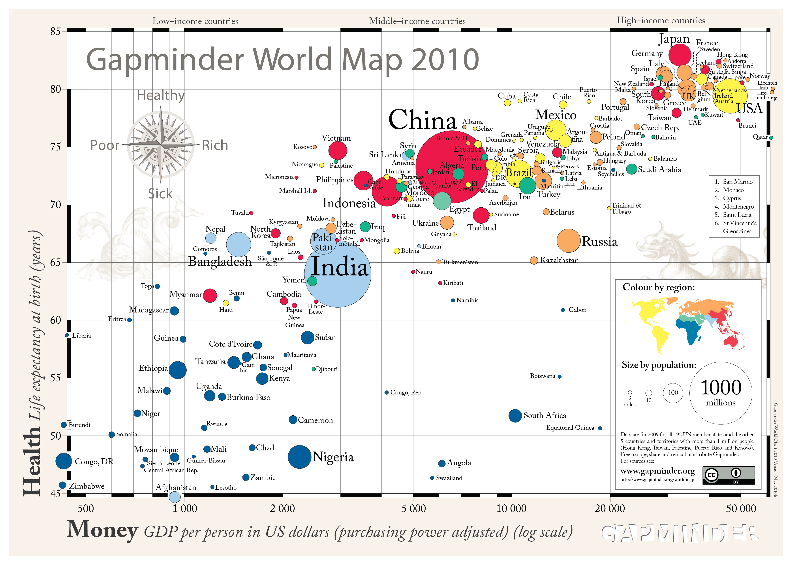

name: inverse
layout: true
class: center, middle, inverse
---
# Data Versioning
# in

.footnote[
  [georgii.rychko@valor-software.com](georgii.rychko@valor-software.com)

  [alexandra.kalinina@valor-software.com](alexandra.kalinina@valor-software.com)
]

???

---

template: inverse
# Goal statement
### Aggregation, visualization, analyzing, using and understanding of statistics and other information about social, economic and environmental development at the local, national and global levels.

---

template: inverse

---

template: inverse
name: goal-page

# The goal shall be achieved by:
&nbsp;
* use and development of information technology for easily understandable visualization of statistics and other information;
* ownership, protection and free dissemination of development results;
* use, together with various cooperation partners, of the development results with a view to making statistics and other information about development available and understandable to broad user groups via the Internet and other media.

.footnote[[wikipedia](https://en.wikipedia.org/wiki/Gapminder_Foundation#Mission_statement)]

---

template: inverse
# Questions?

---
template: inverse
# Thank you

&nbsp;

Contacts:

[georgii.rychko@valor-software.com](georgii.rychko@valor-software.com)

[alexandra.kalinina@valor-software.com](alexandra.kalinina@valor-software.com)
