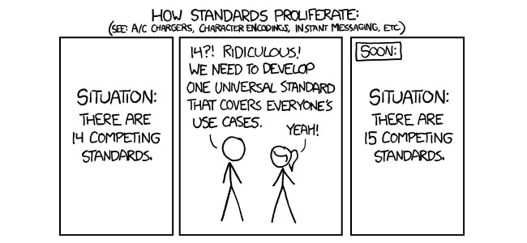

name: presentation
layout: true
class: center, middle, inverse
---

name: introduce
template: inverse
# Time-based data versioning 
# build with github, mongo and nodejs

.footnote[
  [georgii.rychko@valor-software.com](georgii.rychko@valor-software.com)

  [alexandra.kalinina@valor-software.com](alexandra.kalinina@valor-software.com)
]

???

---

name: data-providers
template: inverse
## Data providers
&nbsp;

???
* Unicef - The United Nations International Children's Emergency Fund is a United Nations program headquartered in New York City that provides humanitarian and developmental assistance to children and mothers in developing countries.
* UNESCO - The United Nations Educational, Scientific and Cultural Organization (UNESCO)[2] is a specialized agency of the United Nations (UN). Its declared purpose is to contribute to peace and security by promoting international collaboration through educational, scientific, and cultural reforms in order to increase universal respect for justice, the rule of law, and human rights along with fundamental freedom proclaimed in the United Nations Charter.[1] It is the heir of the League of Nations' International Committee on Intellectual Cooperation.
* The World Bank - The World Bank has set two ambitious goals to push extreme poverty to no more 3 percent by 2030, and to promote shared prosperity and greater equity in the developing world.

---

name: datasets-differences
template: inverse
## Huge differences between datasets:
&nbsp;
* file extensions: xls, csv, json, xml, ...
* file names: ` Cause of death 2015_218f339.xlsx `, ` WEOApr2015all.xls `
* file structures: tabs, columns, extra information ...
* dimensionalities: `year x country x age x death`, `quarter x region x gini` 
* units of measurement: `items, thousands, millions`
* interpretations (specific terms): `MDG region`, `IncSharU`, `IncDefn`

Not saying about different languages in which this data can be presented

---

name: statistic-issues
template: inverse
## How datasets could be aggregated, analyzed and visualized?
&nbsp;
#### visualization library or tool (vizabi)
#### creation new standard/specification (ddf)
#### build data server (waffle)   

???
* visualization tool, which could work with large amount of data on frontend
* creation new standard of the unified data format and query language to it
* build server for import/storing/querying all information needed for visualization   

---

name: gapminder-world
template: inverse
## Visualization library (d3js - Vizabi tool)

???

---

name: standards
template: inverse
## DDF is a data model for collaborative harmonization 
## of multidimensional statistics.
&nbsp;

???
* **Data model.** DDF is a data model, meaning it describes a way to organize data and to define how pieces of data relate to each other.
* **Harmonization.** DDF can be used for data harmonization, meaning it can combine data from different sources into integrated, consistent and unambiguous data sets. DDF supports a practical workflow that results in an easy to maintain and ever growing collection of comparable data.
* **Collaborative.** DDF is the common data model in open numbers. Open numbers is an initiative to crowdsource and harmonize world-data.
* **Multidimensional statistics.** DDF is designed to store statistics with multiple dimensions. For example population per country, per year, per gender, per age group.

To use DDF effectively, it comes with data formats and a query language. 

---

name: ddf-terms
template: inverse
## DDF terms
&nbsp;
#### Datasets
#### Datapoints (Measure, Dimensions, Value)
#### Entities (Countries, Capitals, Regions)
#### Metadata
#### Concepts (Measures, Entity Sets, Entity Domains, Time)

---

name: ddf-example
class: white
## DDF data

---

name: ddf-example
class: white
## DataPoints contain multidimensional data
&nbsp;
#### The population of males in Germany in 2015 was 293958

---

name: ddf-example
class: white
## Entities contain single-dimensional data
&nbsp;
#### The official long name of Germany is Federal Republic of Germany

---

name: ddf-example
class: white
## Metadata contains additional information about data
&nbsp;
#### The source for all population data for germany in 2015 (both male and female) is the central bureau of statistics in germany and the precision is 95%
#### The source for the data that Hong Kong is a Chinese province is the Chinese government

---

name: ddf-example
class: white
## Concepts contain information about 
## the variables in the data set 
### (i.e. the column-headers in a tabular format)
&nbsp;
#### Population is measured in people and has to be bigger than 0.

---

name: waffle-server
template: inverse
## Waffle Server API per Published DataSet
#### Translated MetaData
#### Availability: Combos of Indicators & Dimensions
#### Stats & Entity properties and hierarchy
#### Geo shapes

---

name: main-goal
template: inverse
## Main goal 
### Provide simple and visualizable tool of 
### time-based data versioning for data scientist 

---

name: main-issue
template: inverse
## Main issue
### Propose a solution to time-based versioning
### for entries and their relations (+)
### and implement storage independable query language (-)

---

name: dependency-graph
class: white
## Dependency graph

---

name: final-structure
template: inverse
## Final mongodb structure

---

name: infographics
template: inverse
## Infographics

---

name: relational-database
template: inverse
## Relational database?

???
(from, to, transactions, originId)

---

template: inverse
# Questions?

???
ddf-light example onair?
 
---
template: inverse
# Thank you

&nbsp;

Contacts:

[georgii.rychko@valor-software.com](georgii.rychko@valor-software.com)

[alexandra.kalinina@valor-software.com](alexandra.kalinina@valor-software.com)
